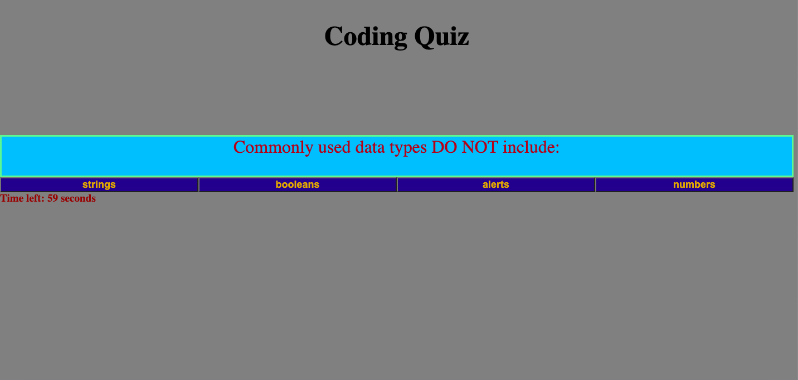

# Coding Quiz App

## Description
This is a short multiple choice web quiz powered by JavaScript.  It includes a countdown timer, five questions, and a score display.  Coding this app involved writing time interval functions, arrays, and JavaScript events.

## Link
[Link to web app](https://tavonns.github.io/coding-quiz-app/)

## Screenshot

